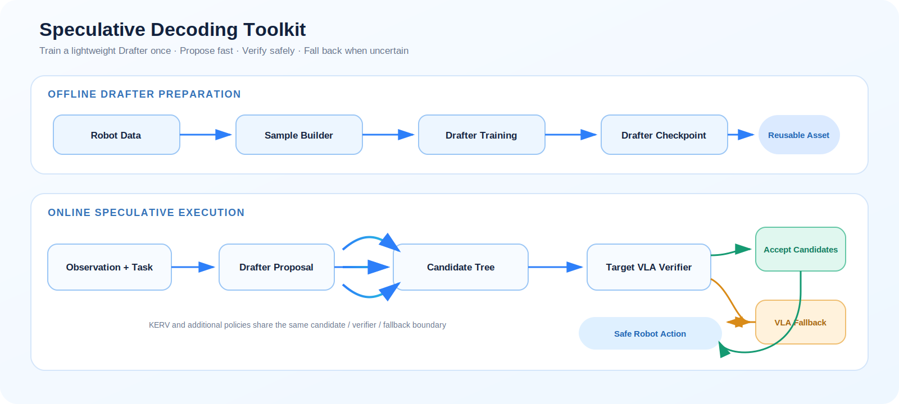
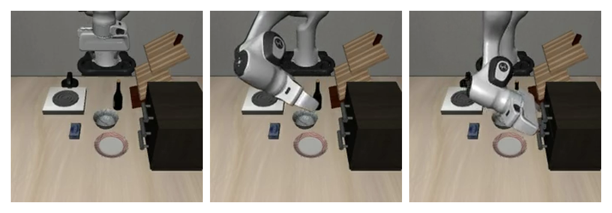

<div align="center">

# RoboNix Speculative Decoding Toolkit

**A reusable KERV-based Drafter, verifier, acceptance, and fallback stack for Vision-Language-Action models**

[Quick Start](#quick-start) · [Training](#step-4-train-the-drafter) · [LIBERO Rollout](#step-5-evaluate-on-libero) · [Validation](#validated-release) · [Roadmap](TODO.md)


[](LICENSE)

</div>

The RoboNix Speculative Decoding Toolkit packages KERV as an independently
runnable Vision-Language-Action (VLA) workflow. A lightweight Drafter proposes
candidate action sequences, the target VLA verifies them in parallel, and the
runtime accepts reliable actions or safely falls back to the original policy.
The toolkit covers data generation, Drafter training, candidate construction,
verification, acceptance, fallback, and bounded LIBERO rollout validation.

## Architecture



Unlike fully autoregressive decoding, speculative decoding uses a smaller draft model to propose multiple candidates before invoking the target model. The target model validates these candidates in parallel. Actual speedup depends on the acceptance rate, candidate-tree shape, GPU, model configuration, and task, and must be measured against an autoregressive baseline under identical conditions.

## Validated Release

The release was validated on an NVIDIA A100 40GB server with an existing
OpenVLA LIBERO-Goal checkpoint and a trained KERV Drafter.

| Check | Result |
| --- | --- |
| Package and independent-root CLI tests | 6 passed |
| Target model + trained Drafter | Loaded as `SpecVLAforActionPrediction` |
| LIBERO smoke rollout | Task 0, 100-step cap, video exported |
| Video artifact | H.264, 224×224, 100 frames, 30 FPS |
| Training entry | Configurable DeepSpeed arguments exposed and parsed |

The bounded rollout intentionally does not claim task success or reproduce a
paper benchmark. It proves model loading, Drafter attachment, simulator
execution, action generation, and video export.



*Validated smoke rollout: first, middle, and final frames from the 100-step run.*

## Quick Start

The repository never ships model weights or datasets. Point the commands below
to existing assets on a large data volume.

```bash
conda create -n robonix-spec python=3.10 -y
conda activate robonix-spec
python -m pip install --upgrade pip
python -m pip install -e .

python -m pytest -q tests
python -m scripts.run --help
```

Run one bounded rollout with a compatible target checkpoint and Drafter:

```bash
export PYTHONPATH="$PWD/vendor/openvla:/path/to/LIBERO:${PYTHONPATH:-}"
export CUDA_VISIBLE_DEVICES=0
export MUJOCO_GL=egl
export MUJOCO_EGL_DEVICE_ID=0

python -m scripts.run \
  experiments/robot/libero/run_libero_goal_Spec.py \
  --model_family openvla \
  --pretrained_checkpoint /data/checkpoints/openvla_goal \
  --spec_checkpoint /data/checkpoints/drafter_goal \
  --task_suite_name libero_goal \
  --task_ids 0 \
  --num_trials_per_task 1 \
  --max_steps_override 100 \
  --local_log_dir /data/outputs/speculative \
  --center_crop True \
  --use_wandb False
```

Videos are written below `./rollouts/<date>/`; evaluation logs use the supplied
`--local_log_dir`. A 100-step cap is for deployment verification, not success
rate measurement.

## Requirements

| Component        | Requirement                                                                            |
| ---------------- | -------------------------------------------------------------------------------------- |
| Operating system | Linux recommended, especially for DeepSpeed and headless LIBERO/MuJoCo                 |
| Python           | 3.10 or later                                                                          |
| PyTorch          | 2.2.0                                                                                  |
| CUDA             | The upstream setup was tested with CUDA 12.1; match PyTorch, CUDA, and driver versions |
| Simulation       | LIBERO 0.1.0 and MuJoCo/EGL for evaluation                                             |
| Training         | DeepSpeed 0.16.6; multi-GPU hardware recommended                                       |

The repository does not include model weights, datasets, or LIBERO assets. Prepare the following before running the full pipeline:

- a target OpenVLA/VLA checkpoint;
- a compatible draft-model checkpoint for speculative evaluation;
- the LIBERO dataset and simulator environment;
- writable directories for generated data, checkpoints, and evaluation logs.

## Step 1: Installation

Clone the project and run all commands from the repository root:

```bash
git clone https://github.com/lusunn111/RoboNix-Speculative-Decoding-Toolkit.git
cd Robonix-Speculative-Decoding-Toolkit

conda create -n spec-decoding python=3.10 -y
conda activate spec-decoding

python -m pip install --upgrade pip
python -m pip install -e .
```

Pinned core dependencies are listed in `requirements/requirements-min.txt`. Additional LIBERO dependencies are available in `benchmarks/libero/experiments/libero_requirements.txt`. Install CUDA-dependent packages using builds compatible with the local driver and toolkit.

Run lightweight smoke checks after installation:

```bash
python -c "import service_bootstrap as s; print(s.activate_vendor())"
python -m scripts.run --help
```

## Step 2: Configuration

Copy the environment template and replace every placeholder with a local path:

```bash
cp configs/.env.example configs/.env
```

```dotenv
KERV_MODEL_ROOT=/path/to/models
KERV_DATA_ROOT=/path/to/datasets
KERV_OUTPUT_ROOT=/path/to/outputs
LIBERO_ROOT=/path/to/libero
CUDA_VISIBLE_DEVICES=0
```

The template documents the path convention but is not loaded automatically by the current research scripts. Export the variables in the shell or pass the corresponding paths through each script's configuration.

Some preserved upstream scripts still contain machine-specific or `PATH_TO_*` placeholders. Locate and replace them before running a full experiment:

```bash
grep -R "PATH_TO\|/SpecVLA" scripts vendor/openvla/specdecoding \
  vendor/openvla/experiments/robot/libero
```

## Step 3: Generate Draft-Model Training Data

The stable runner accepts a script path relative to `vendor/openvla/` and forwards all remaining arguments unchanged:

```bash
python -m scripts.run \
  specdecoding/train-scripts/ge_data_all_openvla_token_only_libero_goal.py \
  --start 0 \
  --end 100 \
  --index 0 \
  --gpu_index 0 \
  --outdir /path/to/generated-data
```

| Argument               | Description                                     |
| ---------------------- | ----------------------------------------------- |
| `--start`, `--end` | Range of samples to process                     |
| `--index`            | Worker or generation job index                  |
| `--gpu_index`        | One or more GPU indices                         |
| `--outdir`           | Output directory for generated training samples |

The script's `vla_path`, dataset path, and related values are currently source-level configuration fields. Set them to valid local assets before execution.

## Step 4: Train the Draft Model

1. Review `configs/ds_config.json` and `configs/llama_2_chat_7B_config.json`.
2. Configure the target VLA, generated dataset, and output paths in `FinetuneConfig`.
3. Launch training with DeepSpeed.

Example:

```bash
cd vendor/openvla/specdecoding/train-scripts

OPENVLA_CHECKPOINT=/path/to/openvla \
DRAFTER_TRAIN_DATA=/path/to/generated-data \
DRAFTER_OUTPUT_DIR=/path/to/drafter-checkpoints \
GPU_IDS=0,1 \
WANDB_MODE=offline \
bash train_ds_libero_goal.sh
```

Adjust GPU indices and the distributed port for the local environment. For reproducibility, record the Git revision, target-model version, data version, DeepSpeed configuration, GPU model, and random seed for every training run.

## Step 5: Evaluate on LIBERO

Configure headless rendering before running an evaluation:

```bash
export CUDA_VISIBLE_DEVICES=0
export MUJOCO_GL=egl
export MUJOCO_EGL_DEVICE_ID=0
```

### Autoregressive Baseline

```bash
python -m scripts.run \
  experiments/robot/libero/run_libero_goal_AR.py \
  --model_family openvla \
  --pretrained_checkpoint /path/to/openvla-checkpoint \
  --task_suite_name libero_goal \
  --center_crop True \
  --use_wandb False
```

### Standard Speculative Decoding

```bash
python -m scripts.run \
  experiments/robot/libero/run_libero_goal_Spec.py \
  --model_family openvla \
  --pretrained_checkpoint /path/to/openvla-checkpoint \
  --spec_checkpoint /path/to/drafter-checkpoint \
  --task_suite_name libero_goal \
  --task_ids 0 \
  --num_trials_per_task 1 \
  --center_crop True \
  --use_wandb False
```

### Relaxed Acceptance

The repository retains experimental entry points for thresholds 9, 15, and 20. For example:

```bash
python -m scripts.run \
  experiments/robot/libero/run_libero_goal_Spec_Relaxed_15.py \
  --model_family openvla \
  --pretrained_checkpoint /path/to/openvla-checkpoint \
  --task_suite_name libero_goal \
  --center_crop True \
  --use_wandb False
```

Supported task suites include `libero_spatial`, `libero_object`, `libero_goal`, `libero_10`, and `libero_90`. Use `--center_crop True` when the target model was fine-tuned with the corresponding image augmentation. Supply a compatible Drafter with `--spec_checkpoint`; use `--task_ids` and `--max_steps_override` for bounded validation before running a complete suite.

## Benchmarking Guidelines

Run autoregressive and speculative entry points with the same hardware, target model, task suite, and random seeds. At minimum, report:

- task success rate and successful episode count;
- end-to-end episode latency;
- per-action generation latency and throughput;
- candidate acceptance rate and average accepted length;
- fallback count;
- peak GPU memory and utilization;
- candidate-tree width, depth, and acceptance configuration.

Do not report model-forward latency as end-to-end latency. Image preprocessing, simulator stepping, warm-up, synchronization, and logging can materially affect results. Warm up the model, repeat runs, and report both averages and percentiles.

## Repository Layout

```text
.
├── modules/                  # Lazy, task-oriented module catalogs
│   ├── drafter/              # Draft networks and proposal logic
│   ├── candidate_generation/ # Candidate-tree generation
│   ├── verification/         # Parallel target-model verification
│   ├── acceptance/           # Acceptance, KV cache, and fallback
│   ├── strategies/           # Standard and experimental strategies
│   ├── data/                 # Data-related entry points
│   └── training/             # Training-related entry points
├── scripts/                  # Stable runner and workflow entry points
├── benchmarks/libero/        # LIBERO experiments and speed tests
├── configs/                  # DeepSpeed, model, and environment templates
├── requirements/             # Core dependency pins
├── tests/                    # Layout, registry, and lazy-import tests
├── utils/                    # Common, loading, and KV-cache utilities
├── vendor/openvla/           # Canonical, import-compatible source tree
└── service_bootstrap.py      # Vendor activation and guarded script runner
```

`vendor/openvla/` is the canonical compatibility copy. The top-level `modules/`, `scripts/`, and `benchmarks/` directories provide an engineering-oriented view of the implementation. When changing an algorithm, clearly identify the authoritative layer and keep any convenience copies synchronized.

The default strategy is `modules.strategies.modeling_speculation`. The `_1`, `_14`, `_7d`, `_jiou`, and `_yuzhi` variants represent distinct research experiments and intentionally remain separate.

## Contributors

We thank [HuiruHe](https://github.com/HuiruHe) and
[zhengzihaoPKU](https://github.com/zhengzihaoPKU) for their contributions to
the toolkit. See [CONTRIBUTORS.md](CONTRIBUTORS.md) for the contributor policy.

## Citation and License

Citation metadata is provided in `CITATION.cff`. The project is licensed under
the Mulan Permissive Software License, Version 2 (Mulan PSL v2); see
[LICENSE](LICENSE). Vendored components retain their included licenses.
